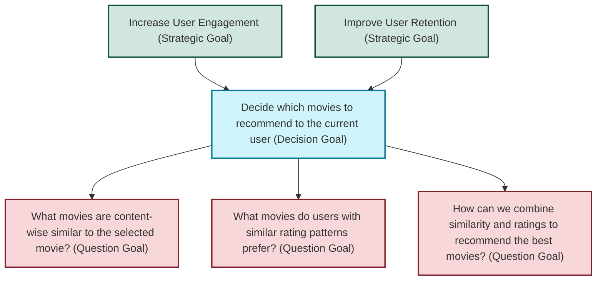
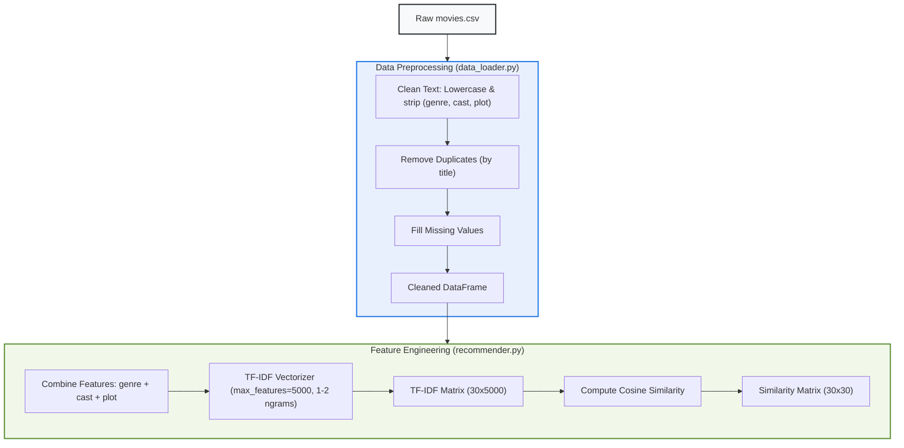

# GR4ML Specification: Movie Recommendation System

This document specifies the **Movie Recommendation ML Application** using the **GR4ML (Goal-Oriented Requirements Engineering for Machine Learning)** framework. It aligns the business objectives, analytical choices, and data pipelines into three complementary views.

---

## 1. Business View

The Business View defines the **"Why"** and **"Who"** of the machine learning system, connecting strategic business objectives with specific decisions and questions that ML can address.

### Actors
*   **End-User (Movie Viewer)**: Wants high-quality, relevant movie recommendations quickly to decide what to watch next.
*   **Platform Owner (Business Stakeholder)**: Wants to increase user engagement, active session length, and user retention.
*   **System Developer/Data Scientist**: Wants to build, evaluate, and maintain robust recommendation models.

### Goal Model Hierarchy



### Key Performance Indicators (KPIs)
*   **Click-Through Rate (CTR)**: Percentage of recommended movies that users click on.
*   **Average Rating (Recommended)**: The average rating of the movies selected by the user from the recommendations list.
*   **Session Retention Rate**: Rate of users remaining active on the platform after seeing recommendations.

---

## 2. Analytics Design View

The Analytics Design View maps the **Question Goals** from the Business View to specific **Machine Learning Tasks**, evaluates alternative algorithms, and balances trade-offs (Softgoals).

### ML Task Mapping

| Question Goal | Analytics Task | Proposed Algorithm(s) |
| :--- | :--- | :--- |
| **QG1**: What movies are content-wise similar? | **Content-Based Filtering (CBF)** | TF-IDF Vectorization on textual features (genre, cast, plot) + Cosine Similarity. |
| **QG2**: What movies do users with similar rating patterns prefer? | **Collaborative Filtering (CF)** | Rating similarity based on genre overlap and rating proximity. |
| **QG3**: How can we combine similarity and ratings? | **Hybrid Filtering** | Weighted scoring blending normalized CBF and CF similarity scores. |

### Evaluation of Softgoals (Trade-offs)

```mermaid
graph TD
    %% Softgoals (Non-Functional Requirements)
    SF1["High Accuracy (Softgoal)"]
    SF2["Low Latency / Real-Time Response (Softgoal)"]
    SF3["Cold-Start Resistance (Softgoal)"]
    SF4["High Recommendation Diversity (Softgoal)"]
    SF5["Explainability of Recommendations (Softgoal)"]
    
    %% Algorithms
    A1["Content-Based (TF-IDF + Cosine Sim)"]
    A2["Collaborative (Rating Proximity)"]
    A3["Hybrid (Weighted Blend)"]
    
    %% Influence Links
    A1 -- + -- SF2
    A1 -- ++ -- SF3
    A1 -- ++ -- SF5
    A1 -- - -- SF4
    
    A2 -- + -- SF1
    A2 -- -- -- SF3
    A2 -- + -- SF4
    A2 -- - -- SF5
    
    A3 -- ++ -- SF1
    A3 -- + -- SF4
    A3 -- - -- SF2
    
    style SF1 fill:#fff3cd,stroke:#664d03,stroke-width:2px;
    style SF2 fill:#fff3cd,stroke:#664d03,stroke-width:2px;
    style SF3 fill:#fff3cd,stroke:#664d03,stroke-width:2px;
    style SF4 fill:#fff3cd,stroke:#664d03,stroke-width:2px;
    style SF5 fill:#fff3cd,stroke:#664d03,stroke-width:2px;
    style A1 fill:#e2e3e5,stroke:#383d41,stroke-width:2px;
    style A2 fill:#e2e3e5,stroke:#383d41,stroke-width:2px;
    style A3 fill:#e2e3e5,stroke:#383d41,stroke-width:2px;
```

*   `++` indicates a strongly positive impact.
*   `+` indicates a positive impact.
*   `-` indicates a negative impact.
*   `--` indicates a strongly negative impact.

---

## 3. Data Preparation View

The Data Preparation View outlines the schema of the raw input data, feature engineering, and the pipelines that feed the recommendation models.

### Raw Data Schema
1.  **movies.csv**:
    *   `title` (String): Title of the movie (Primary Key).
    *   `genre` (String): Comma-separated list of genres.
    *   `rating` (Float): Average movie rating (0.0 to 10.0).
    *   `year` (Integer): Release year.
    *   `cast` (String): Comma-separated list of main actors.
    *   `plot` (String): Brief textual description of the plot.

### Preprocessing and Feature Pipeline



1.  **Text Standardisation**: Features (`genre`, `cast`, `plot`) are converted to lowercase and stripped of leading/trailing whitespaces.
2.  **Deduplication**: Rows with duplicate titles are dropped.
3.  **Feature Combination**: Text fields are concatenated to construct a single string representing the movie's content profile.
4.  **Vectorization**: The combined features are transformed into a numerical matrix using TF-IDF.
5.  **Cosine Similarity Computation**: A pairwise similarity matrix is pre-computed to allow instantaneous content-based recommendations.
